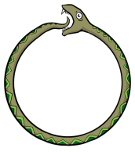

======================
Processes interactions
======================

Interactions among the physiological processes occur.

    Solving the interactions between leaf's water potential, transpiration rate and temperature !

From the one hand. Leaf water potential (:math:`\Psi`) exerts a control on stomatal conductance to water vapor
(:math:`g_{s, \ H_2O}`) and, consequently, on transpiration flux (:math:`E`). However, the latter also determines how much
water will flow through the hydraulic segments to be withdrawn from the soil, which affects the distribution of
water potential across those segments (Ohm's law). Hence, we have a reciprocity between the distribution of water
potential across the shoot (hydraulic structure) and transpiration fluxes from individual leaves.

From the other hand, leaf temperature (:math:`T`) determines the rate of leaf photosynthesis (Arrhenius functions)
and stomatal conductance to both :math:`CO_2` (:math:`g_{s, \ CO_2}`) and water vapor (:math:`g_{s, \ H_2O}`).
This means that :math:`T` affects also the transpiration flux :math:`E` which also means that :math:`T` exerts a further
control on the hydraulic structure.

Putting it all together:

For a given initial temperature (:math:`T_0`) and soil water potential (:math:`\Psi_0`), a leaf can fix :math:`CO_2`
with a rate :math:`A_{n, \ 0}` while having a stomatal conductance rate of :math:`g_{s, \ H_2O, \ 0}`.
The corresponding water flux transpired by this leaf will be :math:`E_0`. Summed up across all leaves, plant
transpiration will withdraw water from the soil, reducing thus soil water potential and resulting in a new :math:`\Psi`
value (:math:`\Psi_1`).
:math:`\Psi_1`, will hence impose a new stomatal conductance :math:`g_{s, \ H_2O, \ 1}` and consequently a new
transpiration flux :math:`E_1`. Yet, this new :math:`E_1` means that leaf temperature is :math:`T_1`... **REWIND**!

HydroShoot resolve this interactions iteratively until reaching steady rate values of :math:`A_n,` and :math:`E` (
implying steady state distribution of water potential cross the shoot). :numref:`fig_2` shows how interactions between
the hydraulic, energy and gas-exchange processes is handled in HydroShoot.

.. _fig_2:

.. figure:: figs/fig_2_ecophysio_solver.png

    Schematic representation of the numerical resolution of HydroShoot. Meteorological inputs that are common
    to all leaves are air temperature (:math:`T_{air}, \ K`), air relative humidity (:math:`RH, \ -`), air
    :math:`CO_2` concentration :math:`[\mu mol\ {mol}^{-1}]`, wind speed (:math:`u, \ m \ s^{-1}`), and atmospheric
    pressure (:math:`P_a, \ kPa`). Inputs per individual leaves are the absorbed photosynthetic photon flux density
    (:math:`PPFD, \ \mu mol \ m^{-2} \ s^{-1}`) and :math:`{PPFD}_{10}` the absorbed :math:`PPFD` during the last
    10 days. :math:`\Psi_u \ [MPa]` is xylem water potential at the nodes between each pair of hydraulic segments.
    :math:`\Psi_{u, \ init} \ [MPa]` is initial :math:`\Psi_u`. :math:`\Psi_{soil} \ [MPa]` is soil water potential.
    :math:`T_i \ [K]` is leaf temperature. :math:`T_{i, \ init} \ [K]` is initial :math:`T_i`.
    :math:`K_{init} \ [kg \ s^{-1} \ m \ {MPa}^{-1}]` is initial hydraulic conductivity of each segment.
    :math:`\epsilon_x \ [MPa]` is the maximum allowable error of the estimation of xylem water potential. Finally,
    :math:`\epsilon_T \ [K]` is the maximum allowable error of the estimation of leaf temperature.
    Circles inside module boxes indicate internal iteration loops. Symbols between curly brackets represent spatially
    structured variables.

