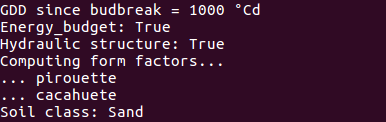
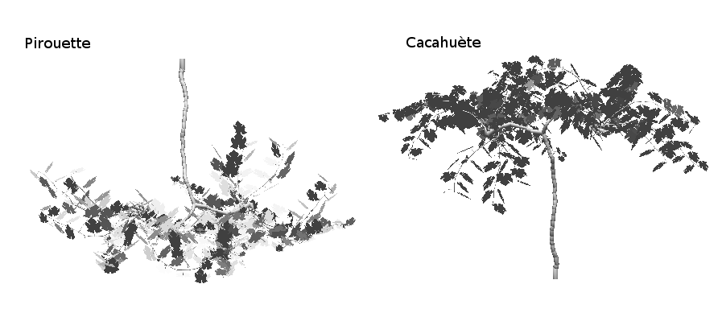

=============
Energy budget
=============

.. figure:: figs/energy_1.png
    :align: center

The *energy* module computes the temperature of individual leaves based on a detailed energy balance model (see
Supporting Information S3 in **Albasha et al., 2019**).

Energy gain of each leaf comes from:

1.  the absorbed shortwave;
2.  thermal longwave radiation from the sky;
3.  thermal longwave radiation from the sky;
4.  thermal longwave radiation from the soil;
5.  thermal longwave radiation from the neighbouring leaves.

Energy loss of each leaf is due to

1. thermal longwave radiation emitted by the leaf
2. latent heat due to transpiration (evaporative cooling)

Energy gain or loss may result from heat exchange between the each leaf and the surrounding air by thermal
conduction-convection.

The resulting leaf-scale energy balance equation writes:

.. math::
    0   & = \alpha_{i, \ R_g} \cdot \Phi_{i, \ R_g} \\
        & + \epsilon_{i, \ leaf} \cdot \sigma \cdot
            \left(
                k_{i, \ sky} \cdot \epsilon_{sky} \cdot T_{sky}^4
                + k_{i, \ soil} \cdot \epsilon_{soil} \cdot T_{soil}^4
                + \left[1 - \left(k_{sky} + k_{soil} \right) \right]
            \right) \\
        & - 2 \cdot \epsilon_{i, \ leaf} \cdot \sigma \cdot T_i^4 \\
        & - \lambda \cdot E_i \\
        & - 2 \cdot K_{air} \cdot \frac{T_i - T_{air}}{\Delta x_i}

where
:math:`i` refers to leaf identifier,
:math:`j` refers to neighbouring leaves identifier,
:math:`\Omega` denotes the upper hemisphere surrounding the leaf :math:`i`,
:math:`\alpha_{R_g} \ [-]` is lumped leaf absorptance in the shortwave band,
:math:`\Phi_{R_g} \ [W \ m_{leaf}^{-2}]` flux density of shortwave global irradiance,
:math:`\epsilon_{leaf} \ [-]` emissivity-absorptivity coefficients of the leaf,
:math:`\epsilon_{sky} \ [-]` emissivity-absorptivity coefficients of the leaf,
:math:`\epsilon_{soil} \ [-]` emissivity-absorptivity coefficients of the soil,
:math:`\lambda \ [W \ s \ {mol}^{-1}]` is latent heat for vaporization,
:math:`\sigma \ [W \ m^{-2} \ K^{-4}]` the Stefan-Boltzmann constant,
:math:`k_{sky} \ [-]` form factor of the sky,
:math:`k_{soil} \ [-]` form factor of the soil,
:math:`T \ [K]` leaf temperature,
:math:`T_{air}` air temperature,
:math:`T_{sky} \ [K]` sky temperature,
:math:`T_{soil} \ [K]` soil temperature,
:math:`K_{air} \ [W \ m^{-1} \ K^{-1}]` the thermal conductivity of air,
:math:`E \ [mol \ m_{leaf}^{-2} \ s^{-1}]` transpiration flux, and
:math:`\Delta x_i \ [m]` thickness of the boundary layer.

.. note::
    Only the forced convective heat transfer is currently considered in HydroShoot since forced convection dominates
    free convection once wind speed exceeds roughly 0.1 :math:`m \ s^{-1}` **(Nobel 2005)**. This wind speed threshold
    is generally exceeded during diurnal hours. However, under low wind conditions heat transfer may be underestimated.

Sky and soil form factors: the *Pirouette Cacahuete* issue!
-----------------------------------------------------------

You may notice once you do your first run something like this:

This refers to the method used to calculate the lumped sky and soil form factors (respectively :math:`k_{sky}` and
:math:`k_{soil}`).

In order to reduce calculation costs, :math:`k_{sky}` and :math:`k_{soil}`) are obtained by flip flopping the canopy:

At first, the canopy is turned downwards. A unit irradiance is emitted from each sky sector and irradiance that is
intercepted by a leaf :math:`i` is assumed equivalent to the form factor between that leaf and the "soil".
In the second step, the canopy is turned upwards again and similarly, a unit irradiance is emitted from each sky sector.
In this case, irradiance that is intercepted by a leaf :math:`i` is assumed equivalent to the form factor between that
leaf and the "sky".

This method is clearly not 100% precise. It may need further improvements in the future.