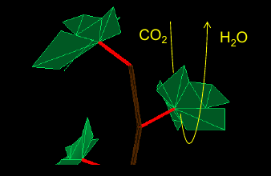

============
Gas exchange
============

The *exchange* module computes the rates of net carbon assimilation of C3 plants (:math:`A_n`), stomatal conductance
to CO2 (:math:`g_{s, \ CO_2}`) and water vapor (:math:`g_{s, \ H_2O}`), and transpiration (:math:`E`) per unit leaf
surface area as a function of micrometeorological conditions and leaf water status.

:math:`A_n` and :math:`g_{s, \ CO_2}` are coupled based on the analytical solution proposed by **Yin et al. (2009)**
which also considers mesophyll conductance to CO2 diffusion :math:`g_m`. The solution is based on the following
equations (following **Evers et al. 2010** supporting information):

.. math::
    \begin{array}{l}
        A_n = \frac{(C_c - \Gamma) \cdot x_1}{C_c + x_2} - R_d  \\
        C_c = C_i - \frac{A_n}{g_m}  \\
        g_{s, CO_{2}} = g_{s0, CO_{2}} + m_0 \cdot \frac{A_n + R_d}{C_i - \Gamma} \cdot f_w  \\
        g_{s, CO_{2}} = \frac{A_n}{C_a - C_i - A_n \cdot r_{tb}}
    \end{array}

where
:math:`A_n \ [\mu mol \ m^{-2} \ s^{-1}]` is net carbon assimilation rate,
:math:`R_d \ [\mu mol \ m^{-2} \ s^{-1}]` is mitochondrial respiration in the light,
:math:`\Gamma \ [\mu bar]` is :math:`CO_2` compensation point in the absence of mitochondrial respiration,
:math:`x_1 \ [\mu mol \ m^{-2} \ s^{-1}]` and :math:`x_2 \ [\mu bar]` are intermediate parameters,
:math:`g_m \ [\mu mol \ m^{-2} \ s^{-1} \ {\mu bar}^{-1}]` is mesophyll conductance for :math:`CO_2` diffusion,
:math:`g_{s, \ CO_2} \ [mol \ m^{-2} \ s^{-1} \ {\mu bar}^{-1}]` is stomatal conductance to :math:`CO_2`,
:math:`g_{s0, \ CO_2} \ [mol \ m^{-2} \ s^{-1} \ {\mu bar}^{-1}]` is the residual stomatal conductance to :math:`CO_2`,
:math:`m_0 \ [-]` is a shape parameter regulating the slope between :math:`A_n` and :math:`g_{s, \ CO_2}`,
:math:`f_w \ [-]` is a dimensionless function representing the response of stomatal conductance to soil or plant water status,
:math:`r_{tb} \ [m^2 \ s \ \mu bar \ {\mu mol}^{-1}]` is the combined turbulence and boundary layer resistance for :math:`CO_2`,
:math:`C_a \ [\mu bar]` is air :math:`CO_2` partial pressure,
:math:`C_i \ [\mu bar]` is intercellular :math:`CO_2` partial pressure, and
:math:`C_c \ [\mu bar]` is chloroplast :math:`CO_2` partial pressure.

Net carbon assimilation rate per unit leaf area
-----------------------------------------------
:math:`A_n` is given as:

.. math::
    A_n = V_c \cdot \left(1 - \frac{\Gamma}{C_c} \right) - R_d

where
:math:`V_c \ [\mu mol \ m^{-2} \ s^{-1}]` is carboxylation rate,
:math:`\Gamma \ [\mu {mol}_{CO_2} \ {mol}_{CO_2}^{-1}]` :math:`CO_2` compensation point in the absence of mitochondrial
respiration,
:math:`C_c \ [\mu {mol}_{CO_2} \ {mol}^{-1}]` chloroplast :math:`CO_2` concentration, and
:math:`R_d \ [\mu mol \ m^{-2} \ s^{-1}]` is mitochondrial respiration rate in the light.

:math:`V_c` is given as:

.. math::
    V_c = \min \left(W_c, W_j, W_p \right)

where
:math:`W_c`, :math:`W_j`, and :math:`W_p \ [\mu mol \ m^{-2} \ s^{-1}]` are respectively Rubisco-limited carboxylation
rate, RuBP-limited carboxylation rate, and Triose phosphates-limited carboxylation rate, given as:

.. math::
    \begin{array}{l}
        W_c = \frac{C_c \cdot V_{c, \max}}{C_c + K_c \cdot \left(1 + \frac{O}{K_o} \right)}    \\
        W_j = \frac{J}{4 + 8 \cdot \frac{\Gamma}{C_c}}    \\
        W_p = \frac{3 \cdot TPU}{\left(1 - \frac{\Gamma}{C_c} \right)}
    \end{array}

where
:math:`V_{c, \ max} \ [\mu mol \ m^{-2} \ s^{-1}]` is the maximum carboxylation rate,
:math:`J \ [\mu mol \ m^{-2} \ s^{-1}]` electron transport rate,
:math:`TPU \ [\mu mol \ m^{-2} \ s^{-1}]` Triose phosphates transport rate,
:math:`K_c \ [\mu mol \ {mol}^{-1}]` Michaelis-Menten constant for the carboxylase,
:math:`K_o \ [mmol \ {mol}^{-1}]` Michaelis-Menten constant for the oxygenase, and
:math:`O \ [mmol \ {mol}^{-1}]` oxygen concentration.

Finally, :math:`J` is given as:

.. math::
    J = \frac{\alpha \cdot {PPFD}}{\sqrt{1 + \frac{\alpha^2 \cdot {PPFD}^2}{J_{max}^2}}}

where
:math:`J_{max} \ [\mu mol \ m^{-2} \ s^{-1}]` is maximum electron transport rate, and
:math:`PPFD \ [\mu mol \ m^{-2} \ s{-1}]` is photosynthetic photon flux density.

The impact of leaf temperature on the photosynthesis parameters is accounted for using Arrhenius functions.
For :math:`V_{c, \ max}`, :math:`J_{max}`, :math:`TPU`, and :math:`R_d` temperature dependency writes:

.. math::
    P = P^{25} \cdot \
        \frac   {\exp \left(c - \frac{\Delta H_a}{R \cdot T_{leaf}} \right)}
                {1 + \exp \left(\frac   {\Delta S \cdot T_{leaf} - \Delta H_d}
                                        {R \cdot T_{leaf}} \right)}

where
:math:`P` denotes any of :math:`V_{c, \ max}`, :math:`J_{max}`, :math:`TPU`, and :math:`R_d` parameters,
:math:`P^{25}` is the value of :math:`P` at 25 \ :math:`^\circ C`,
:math:`c \ [-]` is a shape parameter,
:math:`\Delta H_a \ [kJ \ {mol}_{CO_2}^{-1}]` is activation energy of the Arrhenius functions,
:math:`\Delta H_d \ [kJ \ {mol}_{CO_2}^{-1}]` is deactivation energy of the Arrhenius functions,
:math:`\Delta S \ [kJ \ K^{-1} \ {mol}_{CO_2}^{-1}]` is entropy term,
:math:`R \ [kJ \ K^{-1} \ {mol}^{-1}]` is the ideal gas constant, and
:math:`T_{leaf} \ [K]` is leaf temperature.

Finally, for :math:`\Gamma`, :math:`K_c`, and :math:`K_o` temperature dependency writes:

.. math::
    P = \exp    \left(
            c - \frac{\Delta H_a}{R \cdot T_{leaf}}
                \right)

Variable intra-canopy photosynthetic capacities
-----------------------------------------------
Leaf photosynthetic traits (
:math:`V_{cmax}`, :math:`J_{max}`, :math:`TPU` and :math:`R_d`; cf. Appendix I in **Albasha et al., 2019**) are set
to vary as a function leaf nitrogen content per unit leaf surface area (:math:`N_a, \ g_N \ m^{-2}`) following
**Prieto et al. (2012)**:

.. math::
    P^{25} = S_{N_a} \ N_a - b_{N_a}

where
:math:`P^{25} \ [\mu mol \ m^{-2} \ s^{-1}]` is the value at 25 :math:`^\circ C` for any of the rates
of :math:`V_{cmax}`, :math:`J_{max}`, :math:`TPU` or :math:`R_d`,
:math:`S_{N_a} \ [\mu mol \ g_N^{-1} \ s^{-1}]` and
:math:`b_{N_a} \ [\mu mol \ m^{-2} \ s^{-1}]`
are the slope and the intercept of the linear relationship with :math:`N_a` specific to each rate.

:math:`N_a` is calculated as the product of nitrogen content per unit leaf dry mass (
:math:`N_m, \ g_N \ g_{drymatter}^{-1}`) and leaf dry mass per area (:math:`LMA, \ g_{drymatter} \ m^{-2}`).
:math:`N_m` linearly varies with plant age, expressed as the thermal time cumulated since budburst, and :math:`LMA`
is determined by leaf exposure to light during the last past days **(Prieto et al., 2012)**, as expressed
respectively in the two following equations:

.. math::
    \begin{array}

    N_m = a_N \cdot \sum_{i=budburst}^d {\left( \max{\left( 0, T_{air, \ i} - T_b \right)} \right)} + b_N   \\

    LMA = a_M \cdot \ \ln{(PPFD_{10})} + b_M

    \end{array}

where
:math:`T_{air, \ i} \ [^\circ C]` is the mean temperature of the day :math:`i`,
:math:`T_b \ [^\circ C]` is the base temperature (minimum required for growth), set to 10 :math:`\ ^\circ C` for
grapevine and used for the calculation of thermal time since budburst,
:math:`a_N \ [g_N \ g_{drymatter}^{-1} \ ^\circ C \ d^{-1}]` and
:math:`b_N \ [g_N \ g_{drymatter}^{-1}]` are the slope and intercept of the linear relationship between :math:`N_m`
and accumulated thermal time since budburst,
:math:`PPFD_{10} \ [mol_{photon} \ m^{-2} \ d^{-1}]` is the cumulative photosynthetic photon flux density irradiance
intercepted by the leaf (output of the energy module) averaged over the past 10 days,
:math:`a_M \ [g_{drymatter} \ mol_{photon}^{-1} \ d^{-1}]` and
:math:`b_M \ [g_{drymatter} \ m^{-2}]` are the slope and intercept of the linear relationship between :math:`LMA` and
the logarithm of :math:`PPFD_{10}`.

Photoinhibition
---------------
HydroShoot is provided with an empirical photoinhibition model which assumes that combined heat and water
stresses inhibit photosynthesis by reducing the electron transport rate (:math:`J`):

.. math::
    \begin{array}

    \Delta H_d = \Delta H_{d, \ max} -
        \max    \left(
                    0, \
                    \left( \Delta H_{d, \ max - \Delta H_{d, \ T}} \right) \cdot
                    \min    \left(
                                1, \ \frac{\Psi_{leaf} - \Psi_{leaf, \ max}}{\Psi_{leaf, \ min} - \Psi_{leaf, \ max}}
                            \right)
                \right) \\

    \Delta H_{d, \ t} = \Delta H_{d, \ t1} -
        \left( \Delta H_{d, \ t1} - \Delta H_{d, \ t2} \right) \cdot
        \min    \left(
            1, \ \max   \left(
                            0, \ \frac{T_{leaf} - T_{leaf1}}{T_{leaf2} - T_{leaf1}}
                        \right)
                \right)

    \end{array}

where
:math:`\Delta H_d \ [kJ \ mol^{-1}]` is calculated after accounting for the joint effects of leaf water potential
:math:`\Psi_{leaf} \ MPa` and temperature :math:`T_{leaf} \ [K]`,
:math:`\Delta H_{d, \ max} \ [kJ \ mol^{-1}]` is the value of :math:`\Delta H_d` without accounting for photoinhibition,
:math:`\Delta H_{d, \ T} \ [kJ mol^{-1}]` is the value of :math:`\Delta H_d` after accounting for the effect of
:math:`T_{leaf}`,
:math:`\Psi_{leaf, \ max}` and :math:`\Psi_{leaf, \ min} \ [MPa]` are leaf water potential values at which
photoinhibition starts and reaches its maximum effect, respectively, finally,
:math:`\Delta H_{d, \ T1}` and :math:`\Delta H_{d, \ T2} \ [kJ mol^{-1}]` are empirical thresholds corresponding to
leaf temperatures :math:`T_{leaf1}` and :math:`T_{leaf2}` which are temperatures at which photoinhibition starts and
reaches its maximum effect, respectively.

Transpiration rate per unit leaf area
-------------------------------------

The transpiration rate (:math:`E, \ mol \ m^{-2} s^{-1}`) is calculated as:

.. math::
    E = \frac{1}{\frac{1}{g_{b, \ H_2O}} + \frac{1}{1.6 \cdot g_{s, \ CO_2}}} \left( \frac{VPD}{P_a} \right)

where
:math:`P_a \ [kPa]` is the atmospheric pressure and
:math:`g_{b, \ H_2O} \ [mol \ m^{-2} s^{-1}]` is the boundary layer conductance to water vapor derived from
**Nobel (2005)** as:

.. math::
    g_{b, \ H_2O} = \frac{D_{H_2O} \cdot P_v}{R \cdot T_{leaf} \cdot \Delta x}

with

.. math::
    D_{H_2O} = D_{H_2O, 0} \cdot \frac{P_a}{P_v} \cdot \left( \frac{T_{leaf}}{273} \right)^{1.8}

where
:math:`D_{H_2O}` is the diffusion coefficient of H2O in the air at 0 :math:`^\circ C` (:math:`2.13 \cdot {10}^{-5} \ m^2 s^{-1}`),
:math:`P_a \ [MPa]` is the ambient air pressure at 0 :math:`^\circ C`,
:math:`P_v \ [MPa]` is water vapor partial pressure, and
:math:`\Delta x \ [m]` is the thickness of the boundary layer defined following **Nobel (2005)** as:

.. math::
    \Delta x = 0.004 \sqrt{\frac{l}{v}}

where
:math:`l \ [m]` is the mean length of the leaf in the downwind direction (set to 70% of blade length), and
:math:`v \ [m \ s^{-1}]` is wind speed in the vicinity of the leaf.

Finally, the impact of water stress on stomatal conductance (i.e. via the :math:`f_w` function) is calculated using
one of the following options:

.. math::
    f_w =   \left \{
                \begin{array}{11}
                    \frac{1}{1+\left( \frac{VPD}{D_0} \right)}                             &   (a) \\
                    \frac{1}{1+\left( \frac{\Psi_{leaf}}{\Psi_{crit, \ leaf}} \right)^n}   &   (b) \\
                    \frac{1}{1+\left( \frac{\Psi_{soil}}{\Psi_{crit, \ leaf}} \right)^n}   &   (c) \\
                \end{array}
            \right.

where
:math:`VPD \ [kPa]` is vapor pressure deficit (between the leaf and the air),
:math:`D_0 \ [kPa]` shape parameter,
:math:`\Psi_{leaf} \ [MPa]` leaf bulk xylem potential,
:math:`\Psi_{soil} \ [MPa]` soil bulk water potential (assumed equal to xylem potential at the base of the shoot), and
:math:`\Psi_{crit, leaf} \ [MPa]` leaf water potential at which stomatal conductance reduces to half its maximum value.

In case the option :math:`a` is used, stomatal conductance reduction is considered independent from the soil water
status (i.e. following **Leuning, 1995**). In contrast, Both options :math:`b` and `c` allow simulating stomatal
conductance as a function either of leaf water potential (i.e. regarding shoot hydraulic structure) or soil
water potential (i.e. disregarding the hydraulic structure of the shoot).
