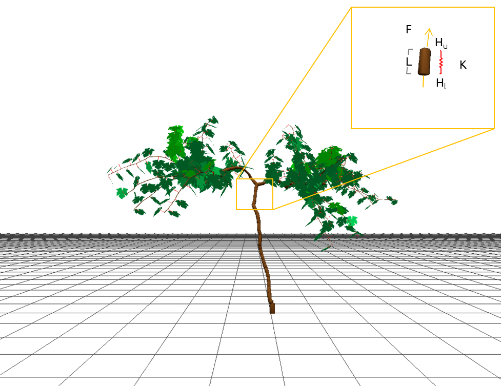

===================
Hydraulic structure
===================

The *hydraulic* module computes the distribution of xylem water potential across plant segments by analogy to Ohm’s law
(:numref:`fig_1_hydraulic`)

.. _fig_1_hydraulic:

    Illustration of the variables required to calculate the hydraulic structure: water flux (:math:`F`),
    hydraulic conductivity (:math:`K`), water pressure at upper (downstream) and lower (upstream) extremities
    of the conducting element (respectively :math:`H_u` and :math:`H_l`), and the length of the segment (:math:`L`).

Water flux (:math:`F, \ kg \ s^{-1}`) across the hydraulic segment of length (:math:`L, \ m`)
is driven by the difference of xylem pressures across this segment (:math:`H_u - H_l, \ MPa`)
and regulated by segment's hydraulic conductivity (:math:`K, \ kgs^{-1} \ m \ MPa^{-1}`):

.. math::
    F = - K \cdot \frac{H_u - H_l}{L}

The hydraulic conductivity varies with water potential as a result of xylem cavitation under water deficit
**(Tyree and Sperry, 1989)**. This relationship is described in HydroShoot as:

.. math::
    K = K_{max} \cdot \frac{1} {\left( 1 + \left( \frac{\Psi}{\Psi_{crit, \ stem}} \right) ^{c_{x1}} \right)}

where
:math:`K_{max} \ [kg \ s^{-1} \ m \ MPa^{-1}]` is the maximum conductivity of the segment,
:math:`\Psi \ [MPa]` is the arithmetic mean of xylem potential of the segment,
:math:`\Psi_{crit, \ stem} \ [MPa]` and
:math:`c_{x1} \ [-]` are shape parameters.

:math:`K_{max}` is estimated empirically as proposed by **Tyree and Zimmermann (2002)** as:

.. math::
    K_{max} = c_{x2} \cdot D^{c_{x3}}

where
:math:`D \ [m]` is the average diameter of the segment, and
:math:`c_{x2}` and
:math:`c_{x3}` are shape parameters, mostly given within the ranges of [2.5, 2.8] and [2.0, 5.0], respectively.

The last two equations apply to all conducting segments (not leaves blades). Water potential of the upper extremity
of the petiole is assumed equal to that of the lumped leaf water potential :math:`\Psi_{leaf} \ [MPa]`.
