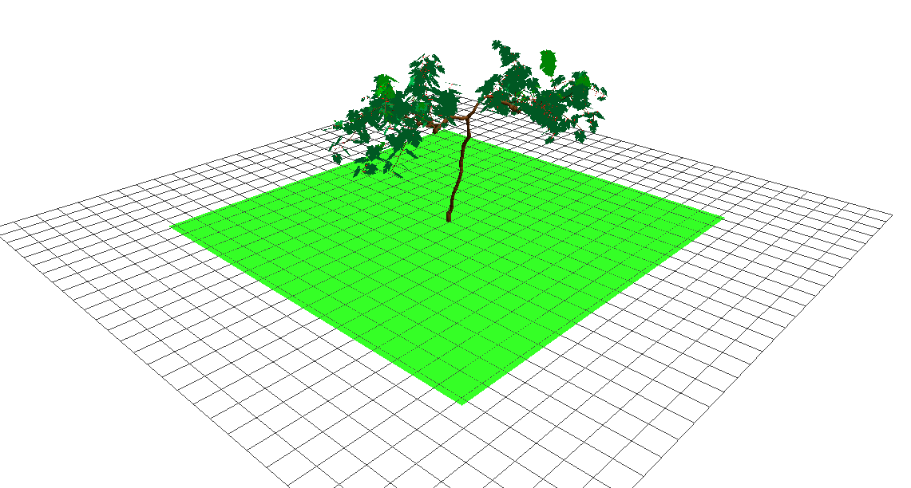
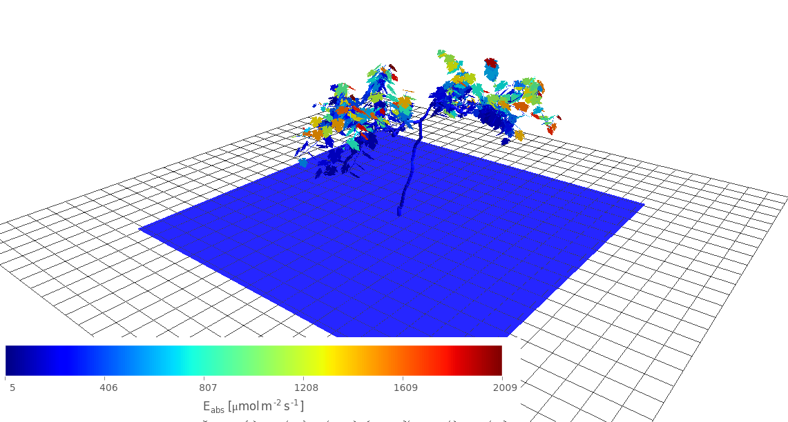
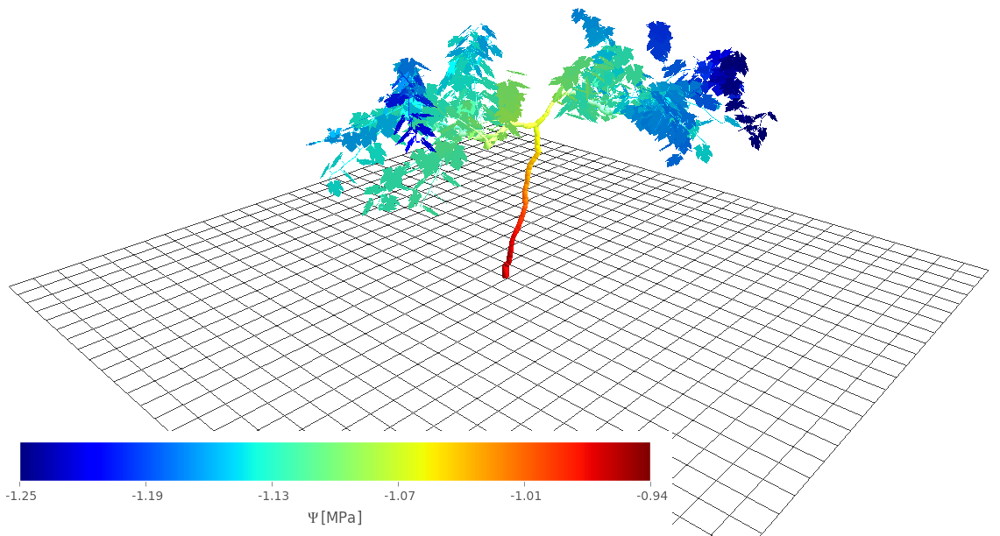
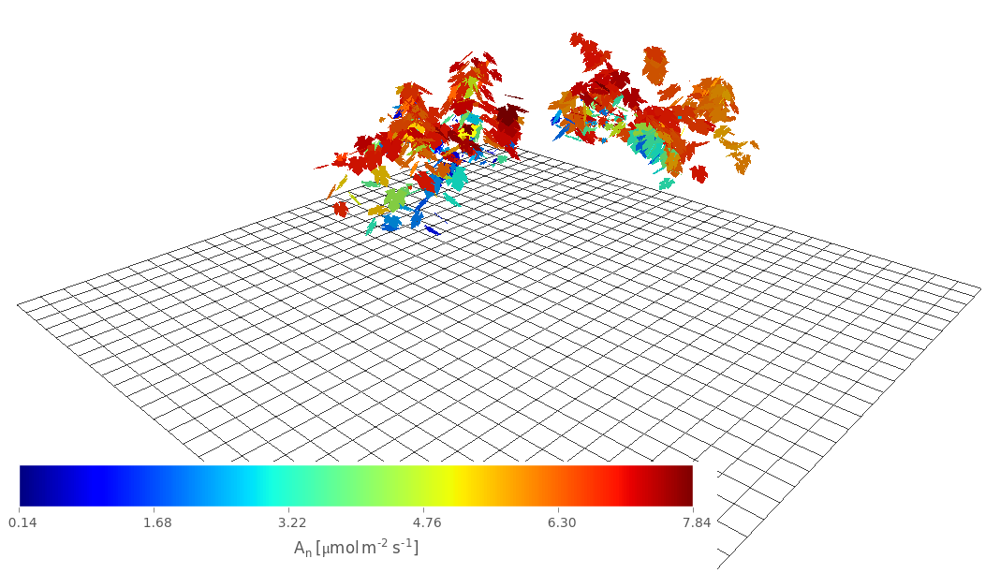
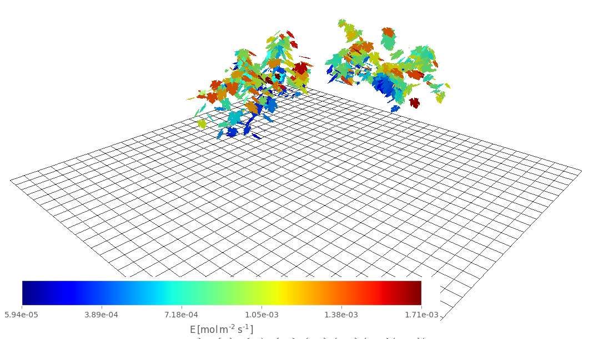
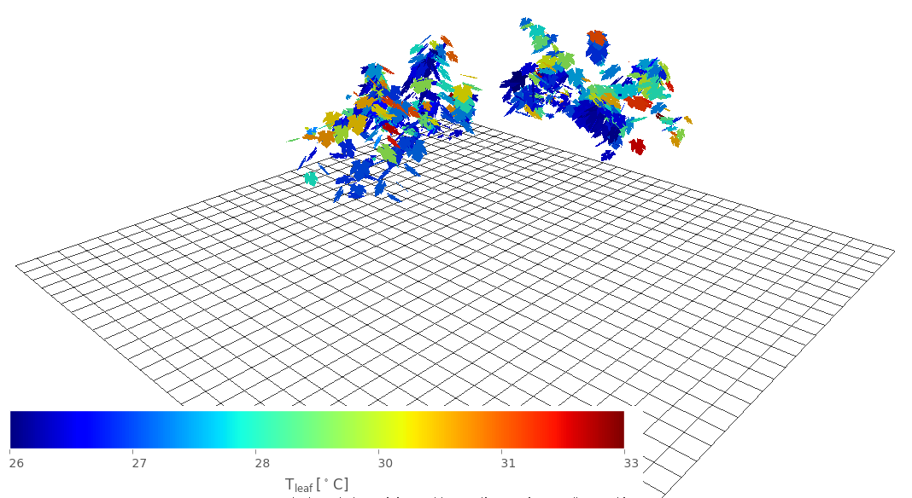

========
Overview
========

What is HydroShoot about?
=========================
HydrShoot is a functional-structural plant model that simulates the interactions between shoot's hydraulic structure,
gas-exchange and energy-budget, at the organ level.

.. table::
    :align: center

    +--------+--------+
    | |fig1| | |fig2| |
    +--------+--------+
    | |fig3| | |fig4| |
    +--------+--------+
    | |fig5| | |fig6| |
    +--------+--------+

**Plant shoot is static** to HydroShoot. That is the model does not simulate plant growth nor its development.
Its usage would therefore be only sound only if shoot's structure can be assumed constant across a given span of time
(let's say a week or so for grapevine).

Why would you be interested in it?
==================================
HydroShoot may be useful for example if you would like to explore:

- how leaf net carbon assimilation rate (:math:`A_n`), transpiration rate (:math:`E`), temperature (:math:`T`) and
  bulk water potential (:math:`\Psi_{leaf}`) interact across the canopy
- how soil water status impacts :math:`A_n`, :math:`E`, :math:`T`, and :math:`\Psi_{leaf}`
- how the structure of the shoot impacts :math:`A_n`, :math:`E`, :math:`T`, and :math:`\Psi_{leaf}`
- how soil water potential (:math:`\Psi_{soil}`) propagates across plant's shoot

