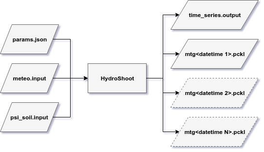
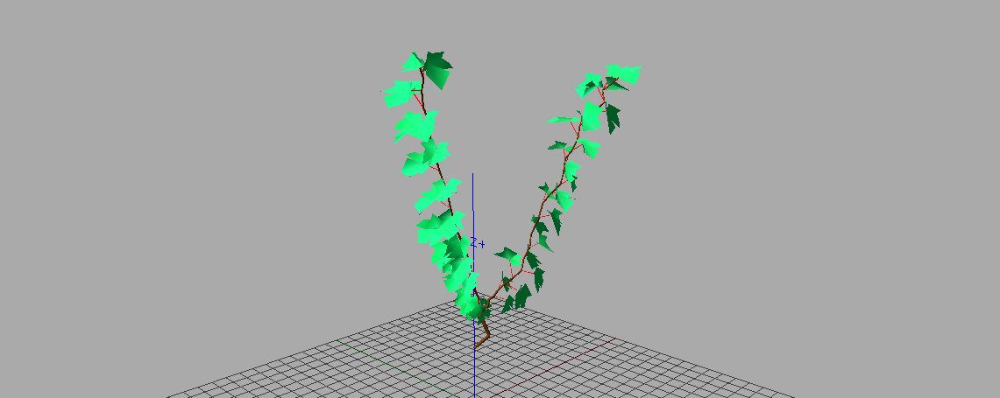

=====
Usage
=====

    Illustration of inputs and outputs of HydroShoot.

Three input files are required in order to run HydroShoot. The first contains all model parameters, the second
meteorological data, and the third (optional) soil predawn water potential data. The model returns an undetermined
number of files (:math:`\geq 3`) of two types of outputs.

Set the required files up
-------------------------

1.  Model parameters

    Almost all model parameters are setup in the **params.json** file.
    *params.json* is a *JavaScript Object Notation (JSON)* file that contains the following sections:

    *  "simulation"
    *  "phenology"
    *  "mtg_api"
    *  "numerical_resolution"
    *  "irradiance"
    *  "energy"
    *  "hydraulic"
    *  "exchange"
    *  "soil"

    Each of the above sections refers to its homonym process. An exhaustive and thoroughly detailed description
    of all the parameters inside each section, their units and their expected values, are given in the
    `params_schema.json` file (src/hydroshoot/). The reader is encouraged to refer to this file to know how exactly
    to fill up the *params.json* file.

2.  Meteorological data (time series)

    Meteorological data must be provided using a .csv file whose name must be given in the
    `params.json` file ("meteo" parameters).
    This file must contain the following columns:
        * `time`: a `datetime` string having the format YYYY-MM-DD HH:MM:SS
        * `Tac`: air temperature :math:`[^\circ C]`
        * `hs`: relative humidity (%)
        * `u`: wind speed :math:`[m \ s^{-1}]`
        * `Rg`: solar radiation (shortwave irradiance) given even in :math:`[W_{global} \ m_{ground}^{-2}]`,
          :math:`[W_{PAR} \ m_{ground}^{-2}]` or :math:`[{\mu mol}_{PPFD} \ m_{ground}^{-2} \ s^{-1}]`.
          The user must provide the unit of `Rg` in the `params.json` file ("E_type" parameter).

3.  Soil predawn water potential data (time series)

    There are two ways to supply predawn soil water potential (:math:`\Psi_{soil}`) to the model:

    a.  using an external file that must be named "psi_soil.input" (the user will be able to give other names to the file
        in the future).

    b.  using the keyword argument "psi_soil" when calling the simulator:

        .. code-block:: python

            from hydroshoot import model

            model.run(g, working_directory, psi_soil=-0.5)

        In this case, the value given in the 'psi_soil' keyword overrides **all values** given in 'psi_soil.input' file.
        HydroShoot will force soil water potential value **at each time step** to that given by the keyword 'psi_soil'.

Outputs
-------

The first output file is a *comma-separated values* (csv) file named "time_series.output" (only one file is returned)
that contains the following time-dependent outputs:

    *   **time**: datetime string (YYYY-MM-DD HH:MM:SS)
    *   **An**: net carbon assimilation flux of the whole plant :math:`[\mu mol \ s^{-1}]`
    *   **E**: tranpiration flux of the whole plant :math:`[g \ h^{-1}]`
    *   **Rg**: absorbed shortwave irradiance by the whole plant :math:`[W \ m_{ground}^{-2}]`
    *   **Tleaf**: median leaf temperature :math:`[^\circ C]`

The second type of outputs is a pickle (pckl) file in which is stored mtg data **for each simulated time step**. Note
that **pckl files do not contain geometry data**. Geometry is not currently stored as an output since the model expects
it as an input.

Run the model
-------------

Let's take the simple example provided in '~/example/potted_grapevine/'. We will use for this example **architecture**
and **display** modules provided with HydroShoot package (these packages may be removed in the future).

This example runs HydroShoot on a small potted grapevine canopy having two primary shoots.

Let's build the mock-up using the digitalization data provided in "grapevine_pot.csv" file:

.. code-block:: python

    from os import getcwd

    from openalea.mtg import traversal
    from openalea.plantgl.all import Scene
    from hydroshoot import architecture, display, model

    # Path for plant digitalization data.
    g = architecture.vine_mtg('grapevine_pot.csv')

    # Local Coordinates Correction
    for v in traversal.iter_mtg2(g, g.root):
        n = g.node(g.Trunk(v, Scale=1)[0])
        theta = 180 if int(n.index()) < 200 else -90 if int(n.index()) < 300 else 0
        architecture.vine_orientation(g, v, theta, local_rotation=True)

    # Scene rotation
    for v in traversal.iter_mtg2(g, g.root):
        architecture.vine_orientation(g, v, 90., local_rotation=False)

    for v in traversal.iter_mtg2(g, g.root):
        architecture.vine_phyto_modular(g, v)
        architecture.vine_mtg_properties(g, v)
        architecture.vine_mtg_geometry(g, v)
        architecture.vine_transform(g, v)

Display now the scene using **display** module, you should be having something like :numref:`fig_mockup`:

.. code-block::

    scene = display.visu(g, def_elmnt_color_dict=True, scene=Scene(),
                         view_result=True)

.. _fig_mockup:

    Screen shot of the mock-up produced by the "potted_grapevine" example.

You're now ready to run the model using the meteorological data provided in "meteo.input", and forcing soil water
potential to a fixed value of -0.5 :math:`MPa`. Ensure first that the model will run over one hour only by setting
start and end dates of the simulation in the "params.json" file ("sdate": "2012-08-01 11:00:00",
"edate": "2012-08-01 11:00:00").

.. code-block:: python

    model.run(g, str(getcwd()) + '/', scene, psi_soil=-0.5,
              gdd_since_budbreak=1000.)

You should now have created the '/output/' folder where output files ("time_series.ouput", "mtg20120801110000.pckl")
are stored. "time_series.ouput" file should contain close values to those below:

.. code-block:: none

    time;An;E;Rg;Tleaf
    2012-08-01 11:00:00;7.39720795547;183.455877322;84.8798347191;27.0144824618

